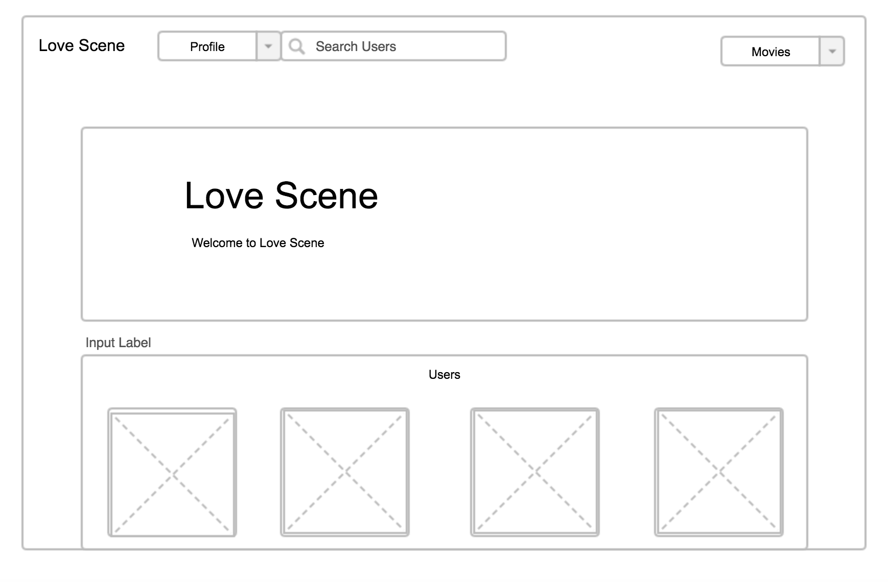
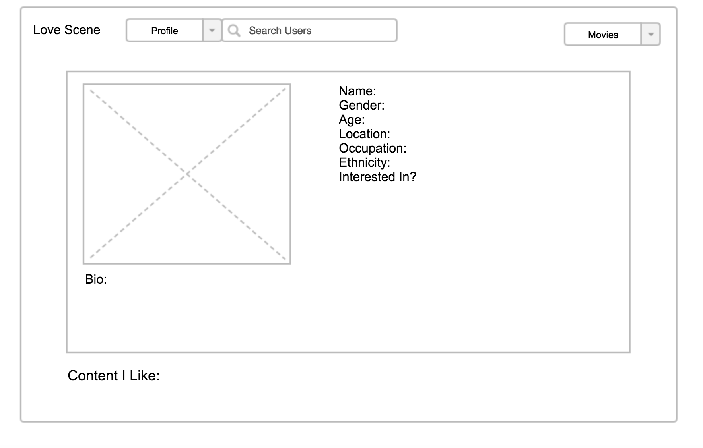
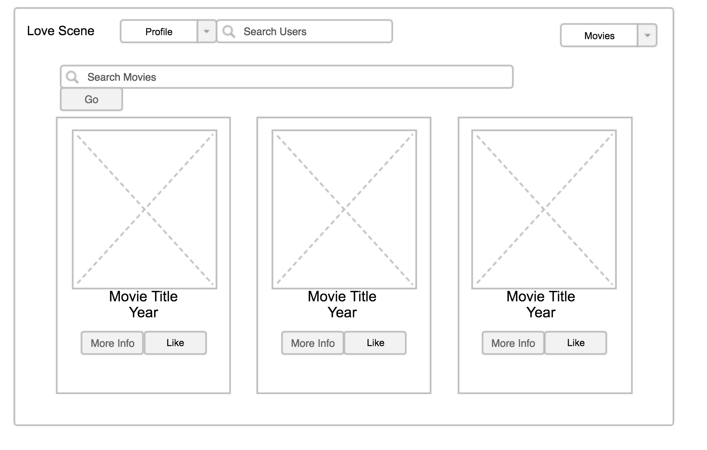
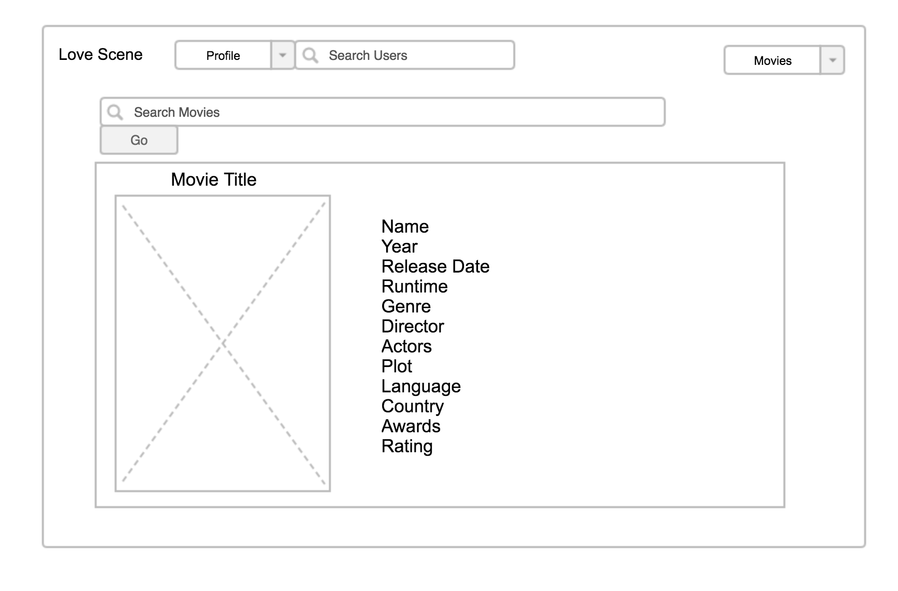

Vist [Love Scene](http://lovescene.herokuapp.com/)

## WDI Project 3: Love Scene

[Love Scene](http://lovescene.herokuapp.com/) was created by Michael Ray, Ed Petil, and Katie Ouaknine

### Objective:
[Love Scene](http://lovescene.herokuapp.com/) is an online dating platform for people who like to stream movies and television shows. Instead of using complicated algorithms to find a mate, we simplified the search by using a single yet sometimes very fortelling criteria. Users can create a dating profile and then search for tv shows and movies they like or would be interested in seeing. Those tv/movie choices are added to their personal profile where other users can search and then compare interests. Need a movie buddy or a date? Love Scene can help you find a mate!

### Installation Instructions
Visit the site and sign-up for an account, or login if a user has already been created. Edit your profile to include whatever personal details you want! Follow the given link to gravatar to link your profile pic
to your account!

### Project Requirements

The guidelines listed below were provided by the project markdown:

* Use of MongoDB and Express to create data CRUD
* Produce a RESTful API that exposes at least one model
* Create an API and consume a third party API using AJAX
* Authenticate users using at least one OAuth provider
* Restrict access to the Creation, Updating and Deletion of resources
* Deploy application online using Heroku

### Technologies Used

* MongoDB + Mongoose
* NodeJS + Express
* JavaScript + JQuery
* AJAX
* Passport
* HTML
* CSS with Bootstrap
* Online Movie Data Base (OMDB) Api
* MD5 for gravatar
* 1x1px.me(for transparent backgrounds)
* Cors for third party API calls

### Approach taken

* Created a [pitch deck](https://www.dropbox.com/s/7vsrpd8vp8vn0kg/Love%20Scene.pptx?dl=0) to layout our project direction.
* Brainstormed as a team and came up with user stories and desired MVP.
* assigned roles within our groups and named a project manager
* used our [trello board](https://trello.com/b/hQPfDagr/lovescene) to designate tasks to group members
* created models, views, and routes that supported the functionality of our application.
* submitted and tested code as the project progressed.
* once functionality was achieved style was added.

### User Stories

* As a User, I want to be able to search for movies by name
* As a User, I want to add movies and TV shows to my profile
* As a User, I want to have an attractive dating profile
* As a User, I want to be able to search for other Users
* As a User, I want to see movies/tv shows other users have added to their profile page

## General App Layout

##Future Implementations

* Chat between users for the purpose of setting up movie dates
* Filter movies by genre
* Filter users by Gender and/or Interest in preference
* Hosted image service so users can have more than one image available on their profile
* direct links to online streaming services that have been liked
* integrate a google maps API so users can find other users near by
